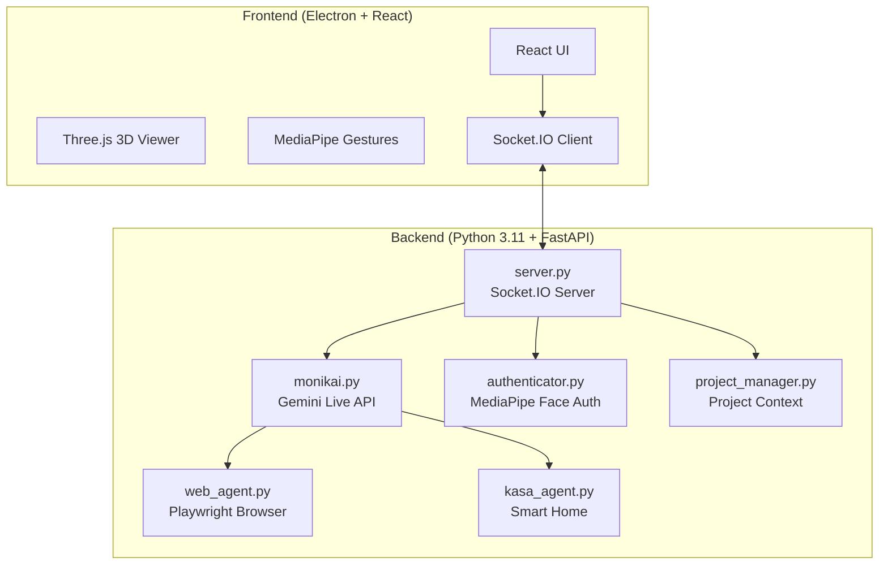

# MonikAI - Your Personal AI Conversation Partner


> **MonikAI** = **Monika** + **AI**

MonikAI is a sophisticated AI conversation partner and assistant designed for multimodal interaction. It combines Google's Gemini 2.5 Native Audio with computer vision, gesture control and short- and long-term memory learning in a Electron desktop application.

---

## Capabilities

| Feature | Description | Technology |
|---------|-------------|------------|
| **Low-Latency Voice** | Real-time conversation with interrupt handling | Gemini 2.5 Native Audio |
| **Screen and Camera Recognition** | Real-time screen retrieval |
| **Long-Term Memory** | AI keeps the conversations recorded and autonomically picks up new information to remember and learn |
| **Minority Report UI** | Gesture-controlled window manipulation | MediaPipe Hand Tracking |
| **Face Authentication** | Secure local biometric login | MediaPipe Face Landmarker |
| **Web Agent** | Autonomous browser automation | Playwright + Chromium |
| **Smart Home** | Voice control for TP-Link Kasa devices | `python-kasa` |
| **Project Memory** | Persistent context across sessions | File-based JSON storage | Separate from Long-Term Memory |

### Application Notes

- **Voice Interaction**: The low-latency voice feature allows for natural conversations with the AI. You can interrupt the AI at any time, and it will respond contextually. The system uses Gemini 2.5's native audio capabilities for real-time processing.

- **Screen Recognition**: MonikAI can analyze what's currently displayed on your screen or your webcam in real-time. This allows the AI to understand your current work context and provide relevant assistance, such as explaining code, commenting on the currently played video game or suggesting improvements.

- **Long-Term Memory**: MonikAI actively listens to you and records information about you (information is stored locally and never sent anywhere). This allows you to personalize your AI and grow together.

- **Gesture Control**: Inspired by the movie "Minority Report", this feature lets you control windows using hand gestures detected by your webcam. It's particularly useful for hands-free operation when working on creative tasks or presentations.

- **Face Authentication**: For security, the app uses local face recognition to unlock access. Your face data is processed entirely on your device and never uploaded to any servers. This ensures privacy while providing convenient biometric login.

- **Web Agent**: The autonomous web browsing capability allows MonikAI to perform tasks on the internet for you. It can search, navigate, fill forms, and extract information from websites, making it a powerful tool for research and automation.

- **Smart Home Integration**: Control your TP-Link Kasa smart devices using voice commands. The system can turn lights on/off, change colors, and adjust brightness levels, integrating seamlessly with your home automation setup.

- **Project Memory**: All conversations and project context are stored locally in JSON files. This allows the AI to maintain continuity across sessions and remember your preferences, ongoing projects, and previous discussions.

> **Tip**: Enable the video feed window to see the hand tracking overlay.

---

MonikAI's "Minority Report" interface uses your webcam to detect hand gestures:

| Gesture | Action |
|---------|--------|
| 🤏 **Pinch** | Confirm action / click |
| ✋ **Open Palm** | Release the window |
| ✊ **Close Fist** | "Select" and grab a UI window to drag it |

> **Tip**: Enable the video feed window to see the hand tracking overlay.

---

## Architecture Overview



---

## TL;DR Quick Start (Experienced Developers)

<details>
<summary>Click to expand quick setup commands</summary>

```bash
# 1. Clone and enter
git clone https://github.com/xtosutosu/monikai && cd monikai

# 2. Create Python environment (Python 3.11)
conda create -n monikai python=3.11 -y && conda activate monikai
brew install portaudio  # macOS only (for PyAudio)
pip install -r requirements.txt
playwright install chromium

# 3. Setup frontend
npm install

# 4. Create .env file
echo "GEMINI_API_KEY=your_key_here" > .env

# 5. Run!
conda activate monikai && npm run dev
```

</details>

---

## Installation Requirements

### Absolute Beginner Setup (Start Here)
If you have never coded before, follow these steps first!

**Step 1: Install Visual Studio Code (The Editor)**
- Download and install [VS Code](https://code.visualstudio.com/). This is where you will write code and run commands.

**Step 2: Install Anaconda (The Manager)**
- Download [Miniconda](https://docs.conda.io/en/latest/miniconda.html) (a lightweight version of Anaconda).
- This tool allows us to create isolated "playgrounds" (environments) for our code so different projects don't break each other.
- **Windows Users**: During install, check "Add Anaconda to my PATH environment variable" (even if it says not recommended, it makes things easier for beginners).

**Step 3: Install Git (The Downloader)**
- **Windows**: Download [Git for Windows](https://git-scm.com/download/win).
- **Mac**: Open the "Terminal" app (Cmd+Space, type Terminal) and type `git`. If not installed, it will ask to install developer tools—say yes.

**Step 4: Get the Code**
1. Open your terminal (or Command Prompt on Windows).
2. Type this command and hit Enter:
   ```bash
   git clone https://github.com/nazirlouis/monikai.git
   ```
3. This creates a folder named `monikai`.

**Step 5: Open in VS Code**
1. Open VS Code.
2. Go to **File > Open Folder**.
3. Select the `monikai` folder you just downloaded.
4. Open the internal terminal: Press `Ctrl + ~` (tilde) or go to **Terminal > New Terminal**.

---

### Technical Prerequisites
Once you have the basics above, continue here.

### 1. System Dependencies

**MacOS:**
```bash
# Audio Input/Output support (PyAudio)
brew install portaudio
```

**Windows:**
- No additional system dependencies required!

### 2. Python Environment
Create a single Python 3.11 environment:

```bash
conda create -n monikai python=3.11
conda activate monikai

# Install all dependencies
pip install -r requirements.txt

# Install Playwright browsers
playwright install chromium
```

### 3. Frontend Setup
Requires **Node.js 18+** and **npm**. Download from [nodejs.org](https://nodejs.org/) if not installed.

```bash
# Verify Node is installed
node --version  # Should show v18.x or higher

# Install frontend dependencies
npm install
```

### 4. Face Authentication Setup
To use the secure voice features, MonikAI needs to know what you look like.

1. Take a clear photo of your face (or use an existing one).
2. Rename the file to `reference.jpg`.
3. Drag and drop this file into the `monikai/backend` folder.
4. (Optional) You can toggle this feature on/off in `settings.json` by changing `"face_auth_enabled": true/false`.

---

## Configuration (`settings.json`)

The system creates a `settings.json` file on first run. You can modify this to change behavior:

| Key | Type | Description |
| :--- | :--- | :--- |
| `face_auth_enabled` | `bool` | If `true`, blocks all AI interaction until your face is recognized via the camera. |
| `tool_permissions` | `obj` | Controls manual approval for specific tools. |
| `tool_permissions.run_web_agent` | `bool` | If `true`, requires confirmation before opening the browser agent. |
| `tool_permissions.write_file` | `bool` | **Critical**: Requires confirmation before the AI writes code/files to disk. |

---

### 6. Gemini API Key Setup
MonikAI uses Google's Gemini API for voice and intelligence. You need a free API key.

1. Go to [Google AI Studio](https://aistudio.google.com/app/apikey).
2. Sign in with your Google account.
3. Click **"Create API Key"** and copy the generated key.
4. Create a file named `.env` in the `monikai` folder (same level as `README.md`).
6. Replace `your_api_key_here` with the key you copied.

> **Note**: Keep this key private! Never commit your `.env` file to Git. The `.env` file should be added to your `.gitignore` file to prevent accidental commits. If you accidentally commit it, revoke the key immediately from Google AI Studio and generate a new one. This key has access to your Google account's Gemini API usage and billing, so treat it like a password.

---

## Running MonikAI

You have two options to run the app. Ensure your `monikai` environment is active!

### Option 1: The "Easy" Way (Single Terminal)
The app is smart enough to start the backend for you.
1. Open your terminal in the `monikai` folder.
2. Activate your environment: `conda activate monikai`
3. Run:
   ```bash
   npm run dev
   ```
4. The backend will start automatically in the background.

### Option 2: The "Developer" Way (Two Terminals)
Use this if you want to see the Python logs (recommended for debugging).

**Terminal 1 (Backend):**
```bash
conda activate monikai
python backend/server.py
```

**Terminal 2 (Frontend):**
```bash
# Environment doesn't matter here, but keep it simple
npm run dev
```

---

## First Flight Checklist (Things to Test)

1. **Voice Check**: Say "Hello Monika". She should respond.
2. **Vision Check**: Look at the camera or share your PC screen. If Face Auth is on, the lock screen should unlock.
4. **Web Check**: Open the Browser window and say "Go to Google". Ask her to look up some information.
5. **Smart Home**: If you have Kasa devices, say "Turn on the lights".

---

## ▶️ Commands & Tools Reference

### Voice Commands
- "Switch project to [Name]"
- "Create a new project called [Name]"
- "Turn on the [Room] light"
- "Make the light [Color]"
- "Pause audio" / "Stop audio"

### Web Agent
- **Prompt**: "Go to Amazon and find a USB-C cable under $10."
- **Note**: The agent will auto-scroll, click, and type. Do not interfere with the browser window while it runs. The web agent uses Playwright to control a Chromium browser instance. It can handle complex interactions like filling forms, clicking buttons, and navigating pages. However, it may struggle with CAPTCHAs, dynamic content loaded via JavaScript, or sites that heavily use anti-bot measures. If the agent gets stuck, you can manually intervene or restart the task.

---

## Troubleshooting FAQ

### Camera not working / Permission denied (Mac)
**Symptoms**: Error about camera access, or video feed shows black.

**Solution**:
1. Go to **System Preferences > Privacy & Security > Camera**.
2. Ensure your terminal app (e.g., Terminal, iTerm, VS Code) has camera access enabled.
3. Restart the app after granting permission.

---

### `GEMINI_API_KEY` not found / Authentication Error
**Symptoms**: Backend crashes on startup with "API key not found".

**Solution**:
1. Make sure your `.env` file is in the root `monikai` folder (not inside `backend/`).
2. Verify the format is exactly: `GEMINI_API_KEY=your_key` (no quotes, no spaces).
3. Restart the backend after editing the file.

---

### WebSocket connection errors (1011)
**Symptoms**: `websockets.exceptions.ConnectionClosedError: 1011 (internal error)`.

**Solution**:
This is a server-side issue from the Gemini API. Simply reconnect by clicking the connect button or saying "Hello Monika" again. If it persists, check your internet connection or try again later.

---

## What It Looks Like

*Coming soon! Screenshots and demo videos will be added here.*

---

## Project Structure

```
monikai/
├── backend/                    # Python server & AI logic
│   ├── monikai.py              # Gemini Live API integration
│   ├── server.py               # FastAPI + Socket.IO server
│   ├── web_agent.py            # Playwright browser automation
│   ├── kasa_agent.py           # TP-Link smart home control
│   ├── authenticator.py        # MediaPipe face auth logic
│   ├── project_manager.py      # Project context management
│   ├── tools.py                # Tool definitions for Gemini
│   └── reference.jpg           # Your face photo (add this!)
├── src/                        # React frontend
│   ├── App.jsx                 # Main application component
│   ├── components/             # UI components (11 files)
│   └── index.css               # Global styles
├── electron/                   # Electron main process
│   └── main.js                 # Window & IPC setup
├── projects/                   # User project data (auto-created)
├── .env                        # API keys (create this!)
├── requirements.txt            # Python dependencies
├── package.json                # Node.js dependencies
└── README.md                   # You are here!
```

---

## Known Limitations

| Limitation | Details |
|------------|---------|
| **macOS & Windows** | Tested on macOS 14+ and Windows 10/11. Linux is untested. |
| **Camera Required** | Face auth and gesture control need a working webcam. |
| **Gemini API Quota** | Free tier has rate limits; heavy CAD iteration may hit limits. |
| **Network Dependency** | Requires internet for Gemini API (no offline mode). |
| **Single User** | Face auth recognizes one person (the `reference.jpg`). |

---

## Contributing

Contributions are welcome! Here's how:

1. **Fork** the repository.
2. **Create a branch**: `git checkout -b feature/amazing-feature`
3. **Commit** your changes: `git commit -m 'Add amazing feature'`
4. **Push** to the branch: `git push origin feature/amazing-feature`
5. **Open a Pull Request** with a clear description.

### Development Tips

- Run the backend separately (`python backend/server.py`) to see Python logs.
- Use `npm run dev` without Electron during frontend development (faster reload).
- The `projects/` folder contains user data—don't commit it to Git.

---

## Security Considerations

| Aspect | Implementation |
|--------|----------------|
| **API Keys** | Stored in `.env`, never committed to Git. |
| **Face Data** | Processed locally, never uploaded. |
| **Tool Confirmations** | Write/CAD/Web actions can require user approval. |
| **No Cloud Storage** | All project data stays on your machine. |

> [!WARNING]
> Never share your `.env` file or `reference.jpg`. These contain sensitive credentials and biometric data.

---

## Acknowledgments

- **[Google Gemini](https://deepmind.google/technologies/gemini/)** — Native Audio API for real-time voice
- **[build123d](https://github.com/gumyr/build123d)** — Modern parametric CAD library
- **[MediaPipe](https://developers.google.com/mediapipe)** — Hand tracking, gesture recognition, and face authentication
- **[Playwright](https://playwright.dev/)** — Reliable browser automation

---

## License

This project is licensed under the **MIT License** — see the [LICENSE](LICENSE) file for details.

---

<p align="center">
  <strong>Built with AI by tosutosu</strong><br>
  <em>Bridging the robot waifus we always wanted</em>
</p>
